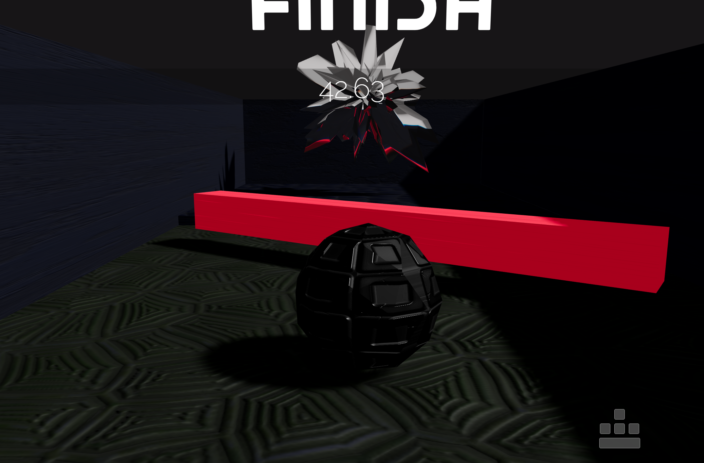

# Marble race game with React Three Rapier



## Dev Memo

Dur to update of react-three-rapier version to `1.4.0`, changed the expression of rey casting `toi` to `timeOfImpact`.

**Player.jsx**

```
  // Util functions =====================================
  // Jump ---------------------------------
  const jump = () => {
    // origin is its contact point to the floor
    const origin = body.current.translation();
    origin.y -= 0.31;

    // rapier version ray casting
    const direction = { x: 0, y: -1, z: 0 };
    const ray = new rapier.Ray(origin, direction);

    // 10 -> maxium distance of ray
    // true -> consider everything as a solid object
    const hit = world.castRay(ray, 10, true);

    if (hit.timeOfImpact < 0.15) {
      // add an impulse from the bottom
      body.current.applyImpulse({ x: 0, y: 0.5, z: 0 });
    }
  };
```
